# Nhập môn mạch số

## Chương 1: Giới thiệu

### Tổng quan Chương 1

- Công nghệ vi điện tử hay vi mạch tích hợp đã có cuộc cách mạng to lớn trên thế giới với các thiết bị thông minh ra đời: laptop, máy tính bảng, điện thoại thông minh, internet, …

- Tương tự (Analog) và Số (Digital)
  
  - Các thiết bị và hệ thống Tương tự (Analog)
  
    - Xử lý trên các tín hiệu liên tục (ví dụ: tín hiệu âm thanh truyền đến một Micro)
  
  - Các thiết bị và hệ thống Số (Digital)

    - Xử lý trên các giá trị rời rạc của tín hiệu tại mỗi thời điểm, giá trị này hoặc bằng 0 hoặc bằng 1(ví dụ: sự sáng hay tắt của một bóng đèn)

  - Hệ thống Tương tự (analog system) thường tiêu tốn nhiều công suất hơn hệ thống Số (digital system)
  
  - Hệ thống Số có thể xử lý, lưu trữ và truyền dữ liệu hiệu quả hơn hệ thống Tương tự, nhưng nó chỉ có thể xử lý tín hiệu tại mỗi thời điểm riêng biệt

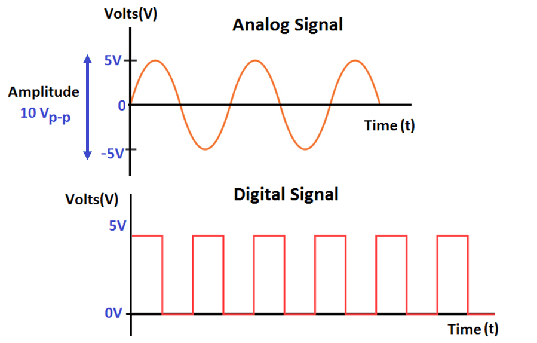

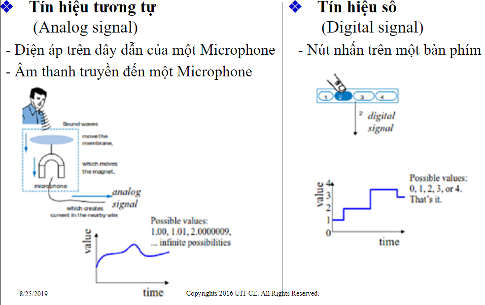

#### Các thiết bị và hệ thống số ngày nay

Ngày nay, thuật ngữ “Số” hoặc “kỹ thuật số” đã trở nên rất quen thuộc thông qua các sản phẩm được sử dụng rộng rãi: computer, điện thoại thông minh, máy tính  bảng, máy nghe nhạc, máy chụp hình/quay phim, tự động hóa, robots, giao thông, truyền thông và giải trí.

#### Những thuận lợi khi thao tác trên dữ liệu số

- Dễ thiết kế

- Thông tin được lưu trữ dễ dàng

- Độ chính xác cao và ít bị tác động bởi nhiễu (noise)

- Có thể lập trình được

- Tốc độ đáp ứng nhanh

- Nhiều mạch số có thể chế tạo thành các Chip

#### Những hạn chế khi thao tác trên dữ liệu số

- Các tín hiệu/thành phần trong thế giới thực chủ yếu tồn tại ở dạng tương tự (analog): nhiệt độ, áp suất, âm thanh, tốc độ.

- Việc chuyển dữ liệu từ dạng tương tự (analog) về dạng dữ liệu số (digital) để xử lý, thông thường 3 bước sau được áp dụng:
  
  - Chuyển tín hiệu tương tự từ thực tại về hình thức số
  
  - Xử lý trên dữ liệu thuộc dạng số
  
  - Chuyển dữ liệu số ở ngõ ra về lại hình thức tương tự rồi xuất kết quả ra bên ngoài.


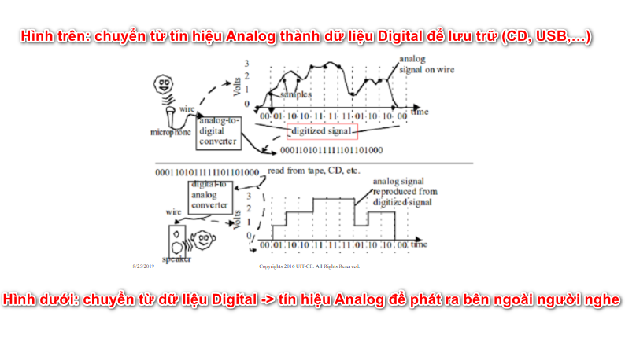

#### Ví dụ thao tác trên dữ liệu số

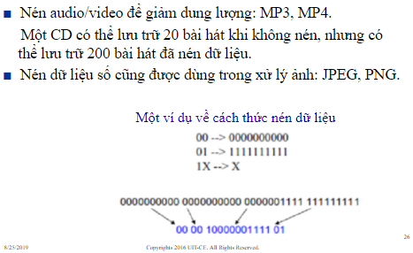

### Những đặc điểm của Số(digital features)

- Trạng thái

  - Cao (High): điện áp từ 2V đến 5V

  - Thấp (Low): điện áp từ 0V đến 0.8V

  - Không xác định (Invalid): điện áp từ 0.8V đến 2V

    - Có thể tạo ra lỗi (error) trong mạch số

  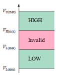

- Dạng sóng kiểu số (digital waveform) thay đổi giữa mức thấp (Low) và mức cao (High) hoặc ngược lại.
  
  - Một xung chuyển mức dương (positive-going pulse) khi nó chuyển từ mức logic thấp (low) đến mức logic cao (high). Ngược lại được gọi là xung chuyển mức âm (negative-going pulse).
  
  - Dạng sóng kiểu số được hình thành từ các chuỗi xung kết hợp lại.

  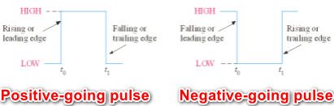

- Dữ liệu Số có thể được truyền giữa hai thiết bị theo kiểu nối tiếp (serial) hoặc theo kiểu song song (parallel)

  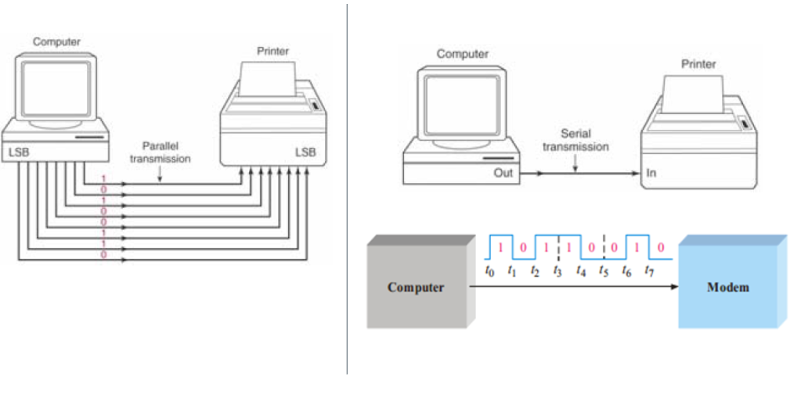

### Qui trình thiết kế Số(digital design processing)

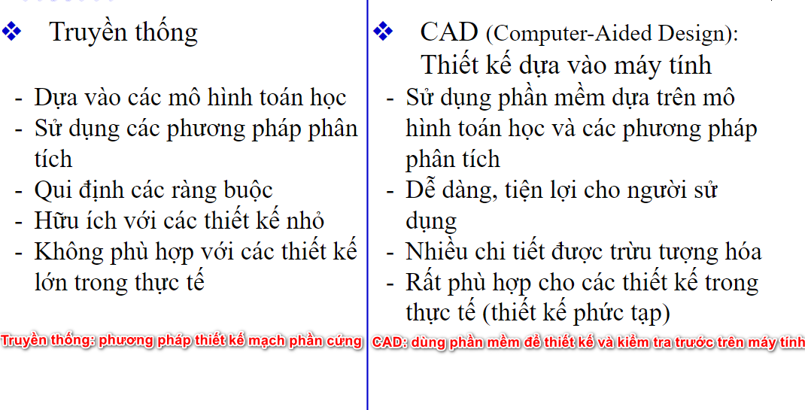

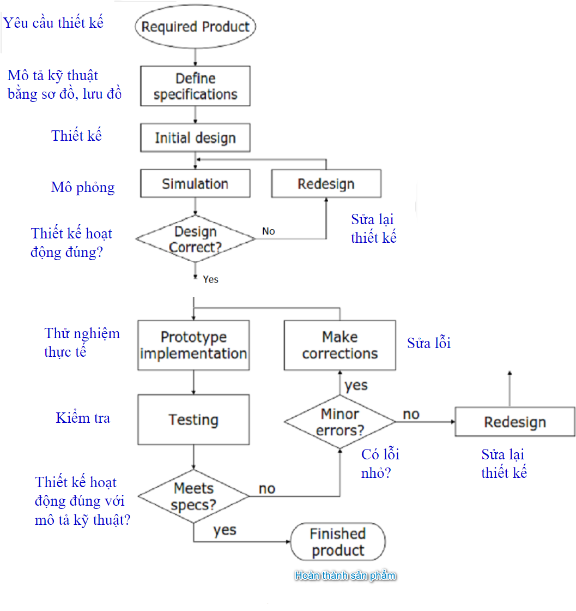

### Các loại chip Số

- Dựa vào đặc điểm và tính năng

  - Các chip tiêu chuẩn, cơ bản (Standard chip)
  
    - Chứa một lượng nhỏ các cổng logic
  
    - Thực thi những hàm, chức năng đơn giản (NOT, AND, OR,…)
  
    - Ví dụ: các chip họ 74xx

  - Các chip có khả năng lập trình được (Programmable Logic Devices (PLD) hoặc Field-Programmable Gate Array (FPGA))

    - Tập hợp các cổng chưa được kết nối, việc kết nối giữa các cổng này được lập trình bởi người sử dụng thông qua các CAD tools

    - Chức năng của chip có thể được thiết kế bởi người sử dụng

  - Các chip chuyên dụng thực hiện một ứng dụng cụ thể (Application-Specific Integrated Circuit (ASIC))

    - Tối ưu để thực thi một chức năng cụ thể

    - Tối ưu về hiệu suất, tốc độ thực thi

    - Nhiều mạch logic được tích hợp hơn

    - Giá thành cao

- Dựa vào độ tích hợp của các cổng logic

  - Độ tích hợp nhỏ (Small Scale Integration - SSI): 1 đến 20 cổng

  - Độ tích hợp trung bình (Medium Scale Integration - MSI): 20 đến 200 cổng

  - Độ tích hợp lớn (Large Scale Integration - LSI): 200 đến 1.000 .000 cổng

  - Độ tích hợp cực lớn (Very Large Scale Integration - VLSI): trên 1.000.000 cổng

### Những thuật ngữ của Số

- **Tương tự (analog)**:  tín hiệu được biểu diễn liên tục

- **Số (digital)**:  biểu diễn một lượng rời rạc hoặc tập hợp của các giá trị rời rạc

- **Nhị phân (binary)**: Một hệ cơ số 2, biểu diễn bằng hai giá trị 0 hoặc 1

- **Bit**:  một ký tự nhị phân, có thể là 0 hoặc 1

- **Chip logic lập trình được (programmable logic chip)**: Một loại chip số có khả năng lập trình được để thực hiện một chức năng cụ thể -> _**FPGA**_

- **Chip logic chức năng cố định (fixed-function logic chip)**: Những loại chip số có chức năng cố định, không thể thay đổi -> _**ASIC**_

## Chương 2: Các dạng biểu diễn số

### Tổng quan Chương 2

- Các hệ thống số/máy tính đều dùng hệ thống số nhị phân để biểu diễn và thao tác. Trong khi, hệ thống số thập phân được dùng rộng rãi và quen thuộc trong đời sống hằng ngày.

- Một số hệ thống số khác (bát phân, thập lục phân,…) cũng được giới thiệu trong chương này giúp cho sự biểu diễn của hệ thống số nhị phân được dễ hiểu và tiện lợi với con người.

- Trình bày các kỹ thuật để chuyển đổi qua lại giữa các hệ thống số.

- Sự biểu diễn và thao tác với số có dấu trong các hệ thống số

- Mục tiêu của chương này:

  - Giới thiệu các hệ thống số (thập phân, nhị phân, bát phân, thập lục phân) và cách chuyển đổi giữa các hệ thống số này.
  
  - Thực hiện các phép toán logic cơ bản: cộng, trừ, nhân với hệ nhị phân
  
  - Giới thiệu số bù 2 (biểu diễn số âm trong máy tính)
  
  - Biểu diễn hệ thập phân bằng mã BCD (rất quan trọng trong các hệ thống số)

### Các hệ thông số


#### Thập phân

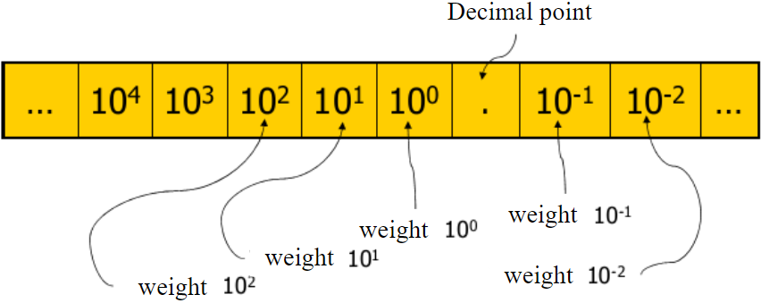

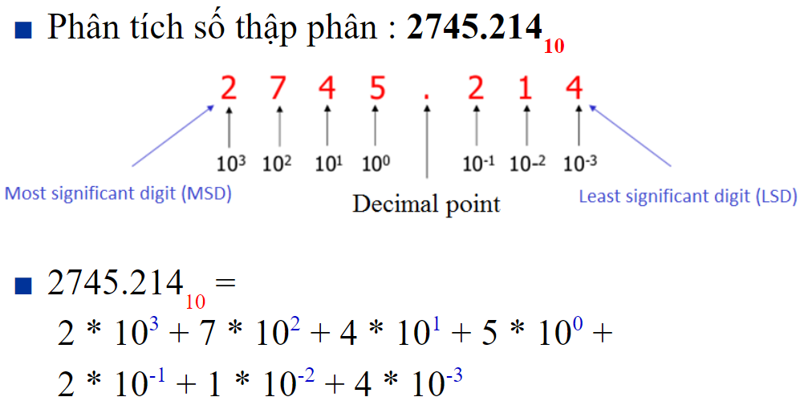

#### Nhị phân

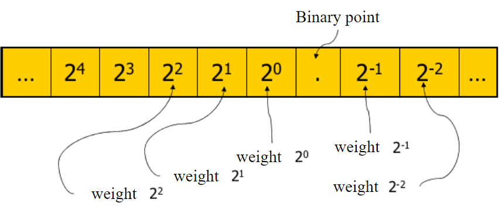

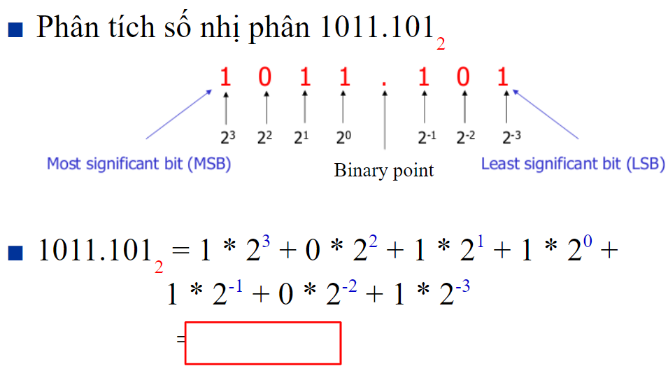

#### Thập lục phân

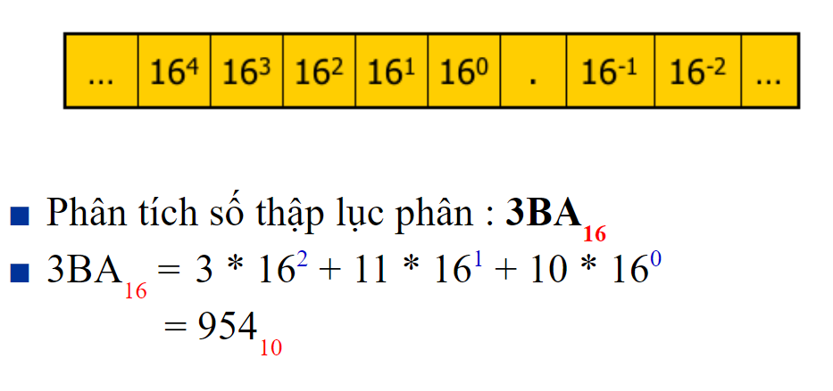

#### Bát phân

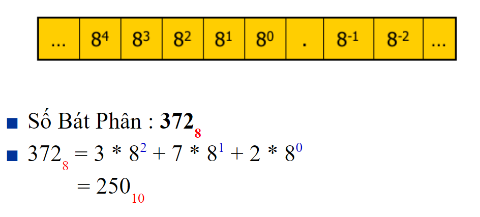

### Chuyển đổi giữa các hệ thống số


- Số thập phân sang nhị phân

  .png)

  .png)

- Số thập phân sang thập lục phân

  .png)

  .png)

- Số thập phân sang bát phân

  .png)

- Số bát phân sang nhị phân

  .png)

- Số thập lục phân sang nhị phân

  .png)

- Số nhị phân sang bát phân

  .png)

- Số nhị phân sang thập lục phân

  .png)

- Bát phân và thập lục phân (áp dụng cho cả ngược lại)

  (Method).png)

  .png)

  .png)

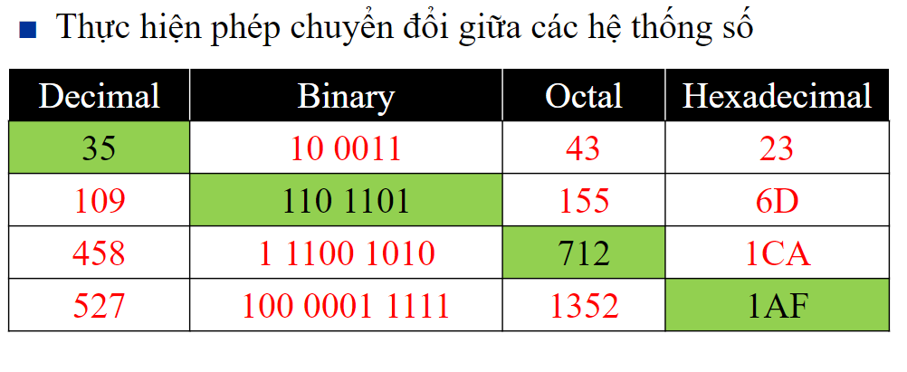

### Biểu diễn số thập phân dưới dạng nhị phân

.png)

.png)

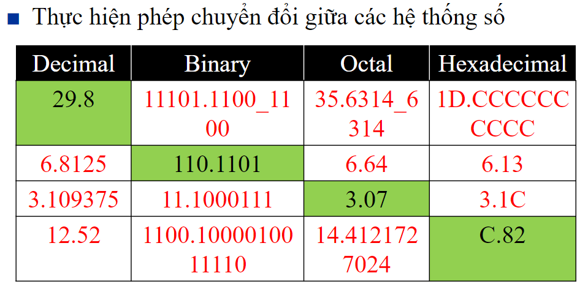

```Example
- 29.8;  11101.1100_1100_1100_...; 35.6314_6314_... ; 1D.CCC…
- Với trường hợp 110.1101, đối với phần sau dấu . khi chuyển qua Octal (Hexa)
  + ta sẽ tự chèn các giá trị 0 vào để chẵn số
  + giá trị gom nhóm sẽ bắt đầu từ dấu chấm sang phải
  + khi lấy sau
  🡪 110.11012 = 110.1101002 = 6.648 11101.
- Thông thường, đề sẽ yêu cầu lấy chính xác bao nhiêu giá trị sau dấu chấm khi chuyển qua nhị phân, Hex, Octal
```

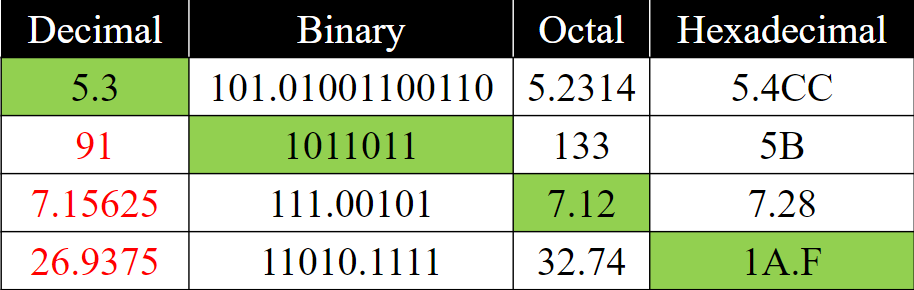

### Các phép tính số nhị phân không dấu

#### Phép cộng số nhị phân không dấu

Cộng 2 số nhị phân 1-bit

Unsigned.png)

Phép cộng 2 số nhị phân không dấu

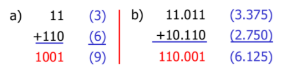

#### Phép nhân số nhị phân không dấu

Nhân 2 số nhị phân 1-bit

Unsigned.png)

Phép nhân 2 số nhị phân không dấu

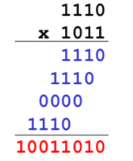

#### Phép trừ số nhị phân không dấu

Quy tắc thực hiện phép trừ như sau:

```Example
0 - 0 = 0 
1 - 1 = 0
1 - 0 = 1
[1]0 - 1 = 1  Mượn 1
```

Phép trừ số nhị phân a và b `(a>b)`


### Biểu diễn số nhị phân có dấu

- Số dương (+) và Số âm (-)

- Sử dụng thêm 1 bit (sign bit) để thể hiện dấu của số:

  ```Example
  0: dương
  1: âm
  ```

- Bit thể hiện dấu nằm ở ngoài cùng bên trái của số

- Có 3 dạng phổ biến để biểu diễn số có dấu:

  - Dạng số “dấu và độ lớn”

  - Dạng số “bù 1"

  - Dạng số “bù 2"

#### Số dấu và độ lớn (Sign-magnitude)

Ví dụ: biểu diễn 1 số 6 bits có dấu

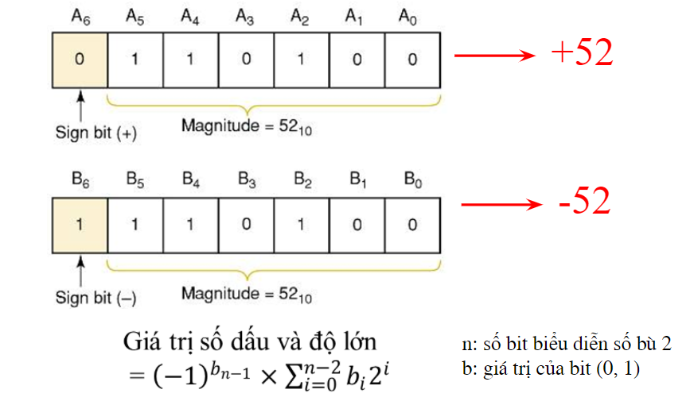

#### Số bù 1 & Số bù 2(1's complement & 2's complement {#ConvertToComplement}

Phương pháp tìm số âm của một số dưới dạng số “bù 1” và dưới dạng số “bù 2”:

BinarySigned.png)

BinarySigned.png)

#### Phép cộng, phép trừ số bù 2

Tại sao trong máy tính sử dụng số bù 2 để thực hiện các phép toán mà không sử dụng số dấu và độ lớn hoặc bù 1.

**Ví dụ 1**: `Dấu và độ lớn: (-1) + 5  = 4 (dương)`

```Example
1001
0101
1110 (âm) 🡺 Sai
```

**Ví dụ 2**: `Bù 1: (-5) + (-2) = -7 (âm)`

```Example
1010 (-5)
1101 (-2)
10111 (-8) 🡺 Sai
```

##### Phép cộng số bù 2

Thực hiện như phép cộng số bù 2

- Bit dấu được xử lý dựa theo cách tương tự như các bit độ lớn

- Bit nhớ ở vị trí cuối cùng sẽ được loại bỏ

- Kết quả của phép cộng sử dụng số bù 2 luôn đúng

.png)

2.png)

##### Phép trừ số bù 2

- Trong ví dụ `4 + (–9)`, phép cộng trong hệ thống số bù 2 thực chất là phép trừ

  .png)

- Quy tắc thực hiện phép trừ trong hệ thống số bù 2:

  .png)

#### Hiện tượng tràn số học(Overflow)

- Tràn: Khi số bit của kết quả vượt quá số bit cho phép

- Số có *dấu bù 2* (n-bit) biểu diễn trong tầm: **-2^n-1^** đến **+2^n-1^-1**

  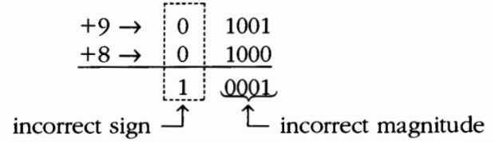

- Hiện tượng Overflow luôn cho kết quả sai hoàn toàn

> Một mạch điện riêng biệt được thiết kế ra để phát hiện hiện tượng tràn

- Ví dụ: Số có 4 bit, gồm 3 bit độ lớn và 1 bit dấu

  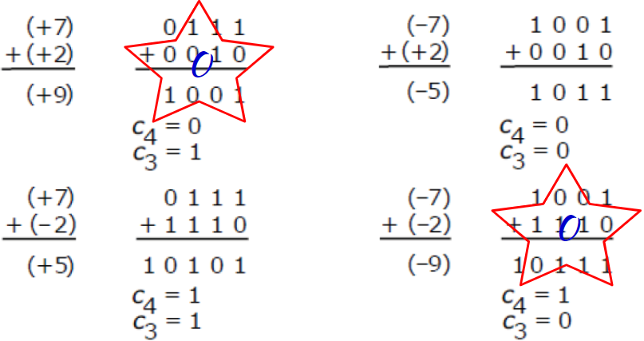

- Hiện tượng Tràn không xảy ra đối với những phép tính giữa 2 số khác dấu nhau

### Biểu diễn các loại số khác

#### BCD(Binary Coded Decimal)

- Mỗi chữ số của số thập phân được biểu diễn bằng số nhị phân 4 bits tương ứng

  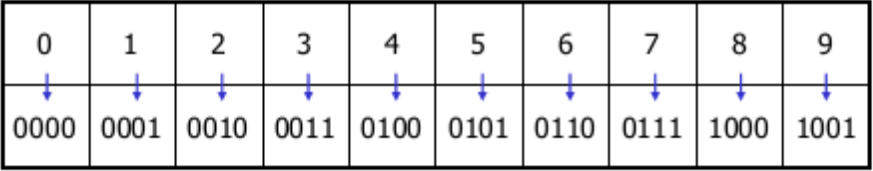

- Công dụng: Hiển thị số thập phân trên các thiết bị máy tính

- Ví dụ:
  10~10~ => BCD
  847~10~ => BCD
  
> 137~10~ = 10001001~2~ (số nhị phân) chuyển thành 137~10~ = 0001_0011_0111(BCD)

- BCD *sử dụng nhiều bit hơn* nhưng việc chuyển đổi đơn giản hơn

#### Số dấu chấm động

Biểu diễn giá trị của tốc độ ánh sáng, c, bằng ký hiệu của số dấu chấm động có độ chính xác đơn (c = 0.2998 x 10^9^)

**Số nhị phân** c = 0001_0001_1101_1110_1001_0101_1100_0000~2~.

**Ký hiệu khoa học**:
  c = 1._0001_1101_1110_1001_0101_1100_0000 x 2^28^  
  S = 0 // số dương
  E = 28 + 127 = 155~10~ = 1001 1011~2~.(IEEE 754, bias = 127)
  F là 23 bits tiếp theo sau khi bit có giá trị 1 đầu tiên xuất hiện.

32-bits độ chính xác đơn(phần cứng)

  C = 0|10011011|0001_1101_1110_1001_0101 _110  

Kí hiệu dấu chấm động có thể biểu diễn cho một số có **giá trị rất lớn** hay **rất nhỏ** bằng cách sử dụng một hình thức ký hiệu khoa học

Ví dụ minh họa 1 số dấu chấm động 32-bit có độ chính xác đơn

  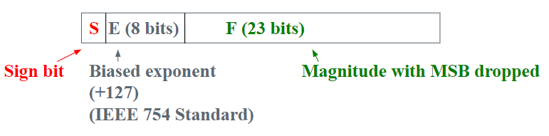

Giá trị thập phân = (-1)^S^ x 1.F x 2^E-127^

#### ASCII (American Standard Codes for Information Interchange)

ASCII-7 (7 bit): dùng để biểu diễn 128 ký tự (character) dưới dạng số nhị phân 7 bit

Ví dụ: Mã ASCII-7 được dùng thể hiện các ký tự từ bàn phím

- (1000001)~ASCII~ = (41H) = `A'
- (1000010)~ASCII~ = (42H) = `B'

- (1100001)~ASCII~ = (61H) = `a'
- (1100010)~ASCII~ = (62H) = `b'

- (0110000)~ASCII~ = (30H) = `0'
- (0111001)~ASCII~ = (39H) = `9'

## Thuật ngữ

_**Byte**_: 1 byte gồm có 8 bits
_**Floating-point number**_: Một số được đại diện dựa trên ký hiệu khoa học, trong đó bao gồm phần số mũ và phần định trị
_**Hexadecimal**_: Hệ thống số có cơ số là 16
_**Octal**_: Hệ số có cơ số nền là 8
_**BCD**_: Binary Coded Decimal: là các mã số, trong đó mỗi chữ số thập phân,  từ 0 đến 9, được đại diện bởi một nhóm bốn bit
_**Alphanumeric(chữ-số)**_: Bao gồm các chữ số, chữ cái, và các ký hiệu khác
_**ASCII**_: Mã tiêu chuẩn của Mỹ dùng trong việc trao đổi thông tin, mã chữ và số được sử dụng rộng rãi nhất.

## Ôn Tập

### Biểu diễn số ở dạng bù 2

VD: biểu diễn -20 ở dạng bù 2

Bước 1: Số 20 ở dạng bù 2 (khi là số dương thì dạng bù 2 giống nhị phân): 20~2~=10100
  
Bước 2: `!10100` = `01011`

Bước 3: 01011+00001 = 01100

[Read more to know about Convert 2's Complement](#ConvertToComplement)

Bước 4: -20 ở dạng bù 2: 11101100

> Khi có số âm chúng ta bổ sung số 1 ở trước đủ 8 bit

### Biểu diễn số dấu chấm động

**Số dấu chấm động có dạng**: *S E M*

#### Dạng thuận

_**Ví dụ: Biểu diễn -2345,125 ra dạng nhị phân**_

Bước 1: -2345,125~2~ = -1001 0010 1001.001

Bước 2: **Chuẩn hóa theo IEEE 32bit**

-1001 0010 1001.001=-1.001 0010 1001 001 x 2^11^

>Lùi dấu chấm ra trước kế bên số đầu tiên, bao nhiêu số thì mũ mấy

Bước 3: **Xác định các thông số S,E,M**

**S**: phần định trị là số *âm* :arrow_right:  `1`
**E**: phần mũ được xác định E = *11*+127 = 138~2~= 1000 1010
**M**: phần định trị được xác định là *001 0010 1001 001*0 0000 0000 (23 số)

>M = dãy số sau dấu chấm sau khi chuẩn hóa, còn lại ghi số 0 cho đủ 23 số

_**Kết quả**_: **(S)**`1` **(E)**`10001010` **(M)**`00100101001001000000000`

#### Dạng nghịch

_**Ví dụ: Biễu diễn 1 10001010 00100101001001000000000 ra dạng thập phân**_

Bước 1: **Coi số đầu tiên**
`1` :arrow_right: `-`
`0` :arrow_right: `+`

Bước 2: **Lấy dãy tiếp theo (E)**

- Lấy dãy phần E chuyển về nhị phân: `10001010 = 138`

- Trừ cho 127 ra số phần mũ: `138-127 = 11`

Bước 3: **Lấy dãy tiếp theo (S)** `00100101001001` đếm đủ **11** số ngăn vô dấu phẩy `00100101001.001`

Bước 4: Thêm số 1 `bài nào cũng thêm số 1, số 1 này không phải là số 1 ở B1` và dấu ở *Bước 1* vào dãy vừa ngăn và đổi sang thập phân

_**Kết quả**_: `- 100100101001.001 = - 2345.125`

## Chương 3: Đại số boolean và các cổng logic

### Tổng quan

Đại Số Boolean chỉ xử lý 2 giá trị duy nhất (2 trạng thái logic): 0 và 1

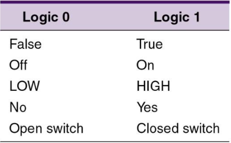

Các cổng logic cơ bản:
OR, AND, NOT, NOR, NAND, XOR, XNOR

Bảng sự thật (Bảng chân trị): Mô tả các mối quan hệ giữa inputs và outputs của một mạch logic

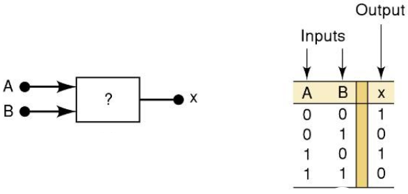

Các giá trị ngõ ra tương ứng với số ngõ vào
Một bảng có 2 ngõ vào sẽ có 2^2^=4 giá trị ngõ ra tương ứng
Một bảng có 3 ngõ vào sẽ có 2^3^=8 giá trị ngõ ra tương ứng

### Cổng logic AND, OR, NOT

#### Cổng logic AND

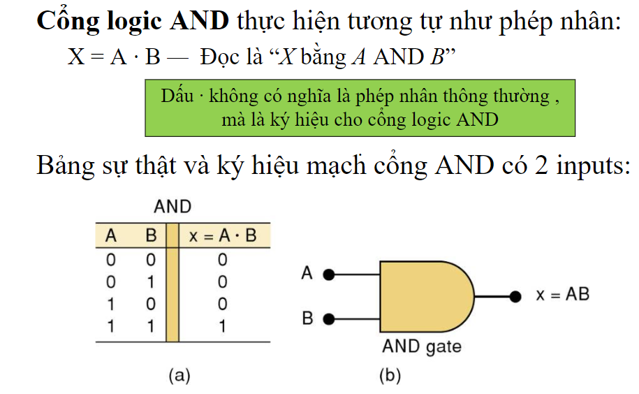

#### Cổng logic OR

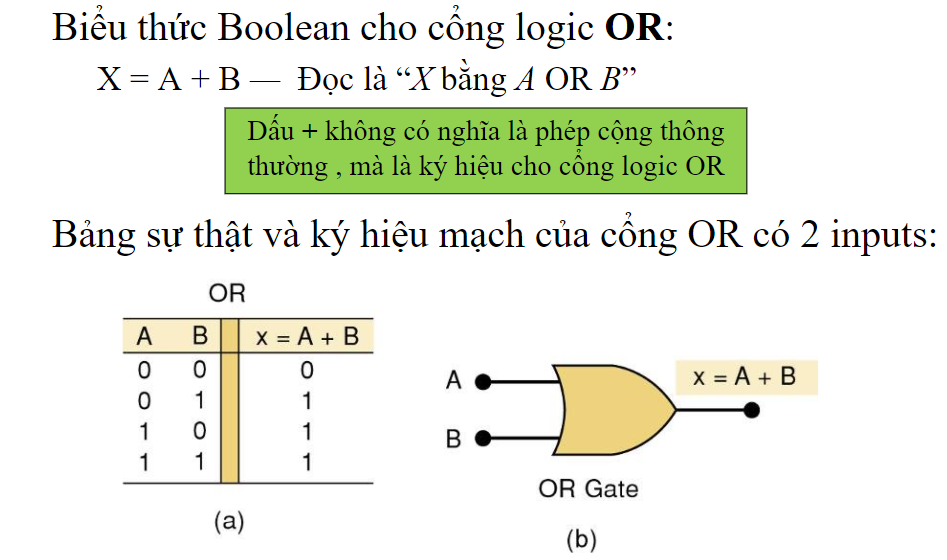

---
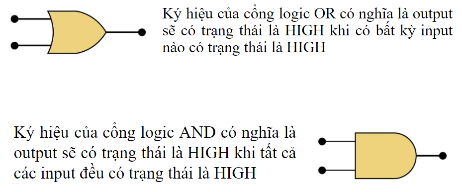

#### Cổng logic NOT

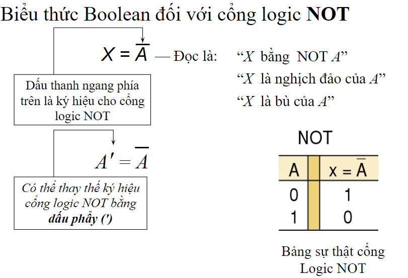

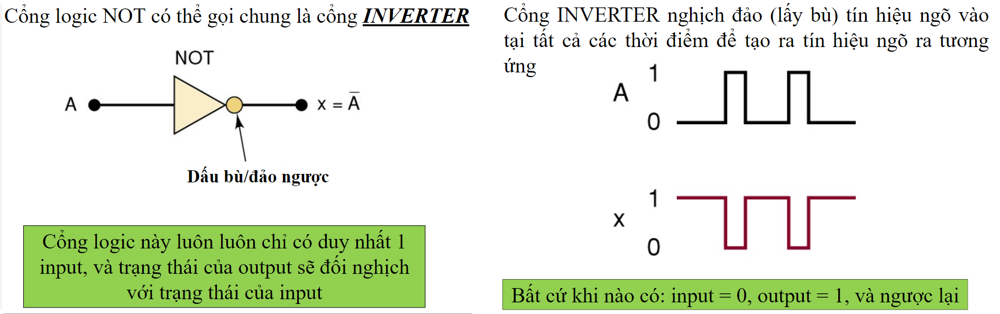

---

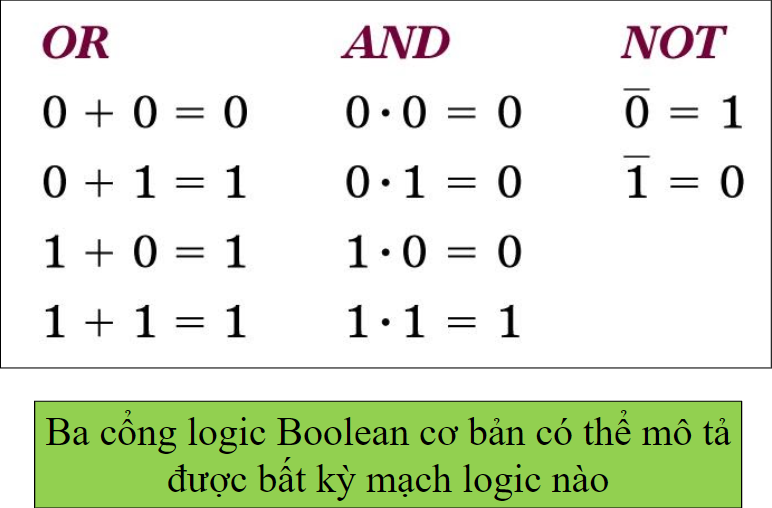

### Cổng logic NAND, NOR

#### Cổng logic NAND

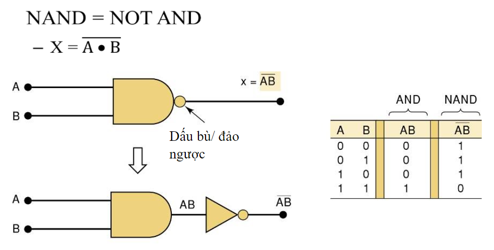

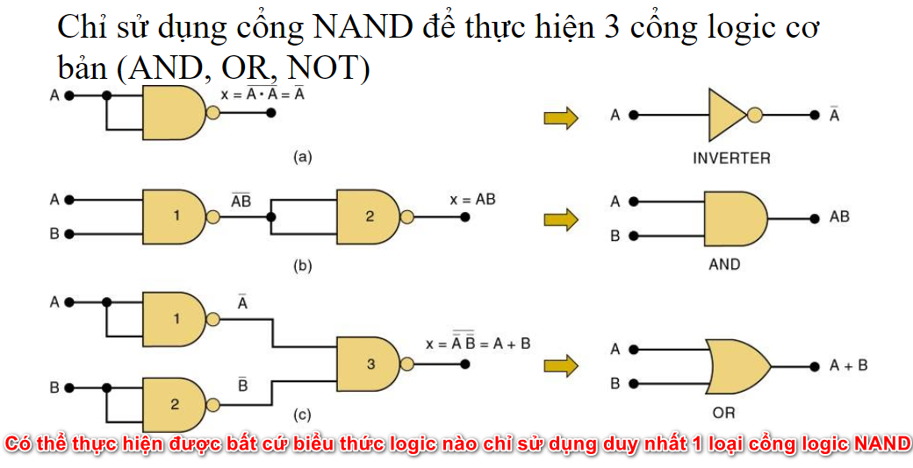

#### Cổng logic NOR

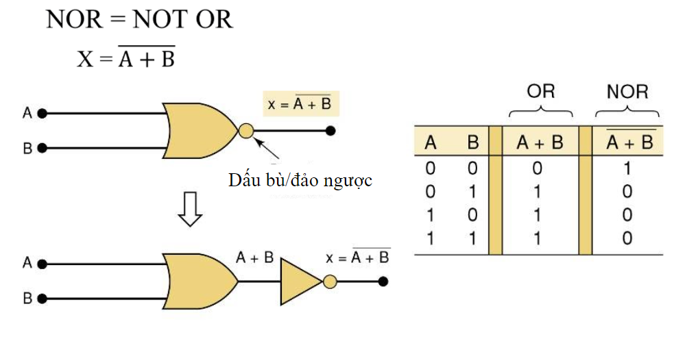

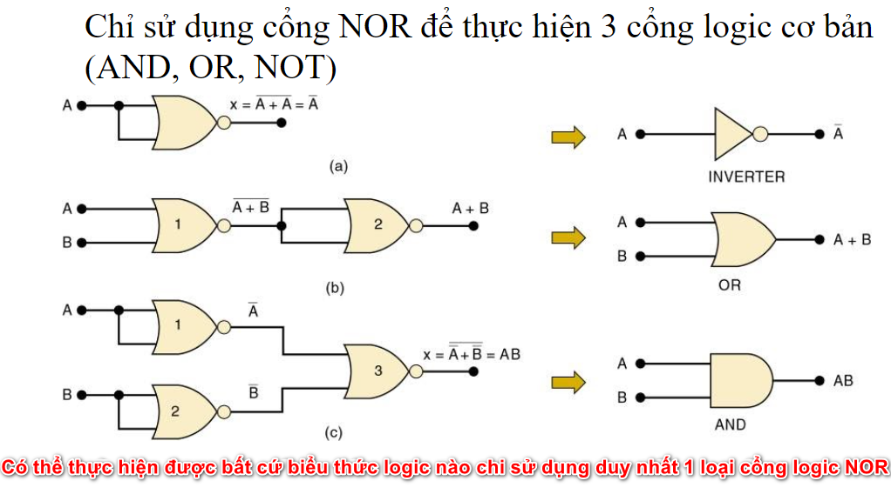

### Cổng logic XOR, XNOR

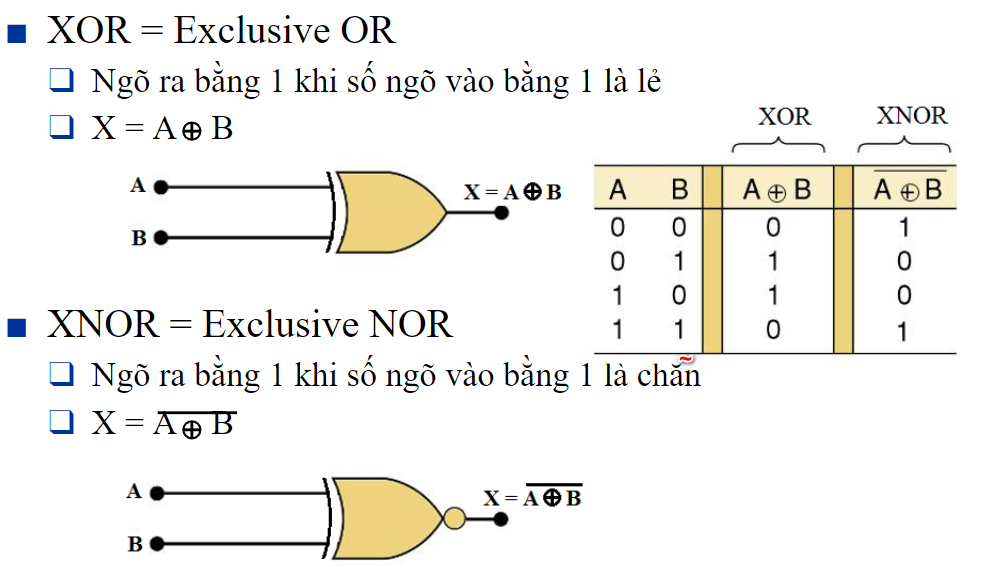

### Thiết kế mạch số từ biểu thức logic

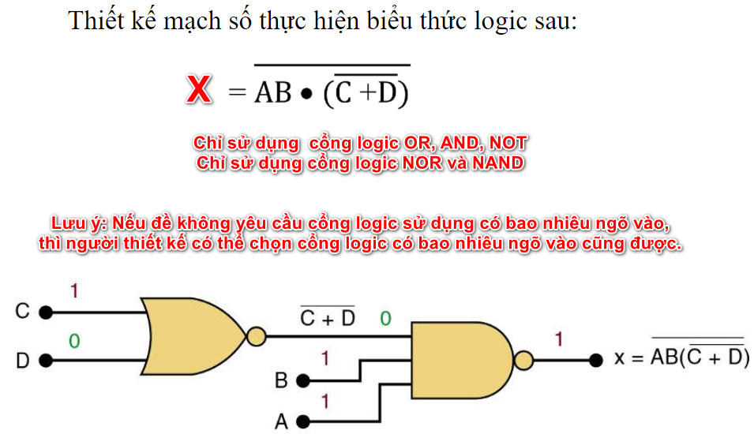

### Xác định biểu thức logic của một mạch số

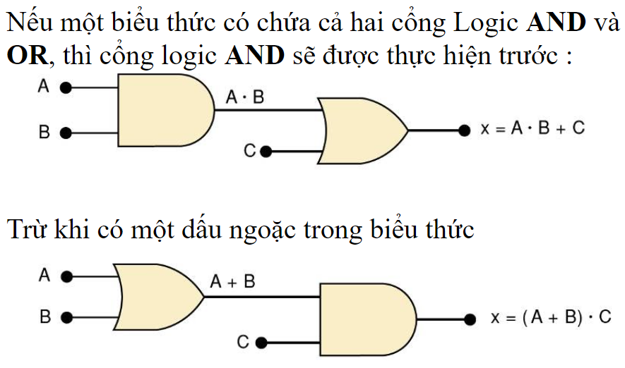

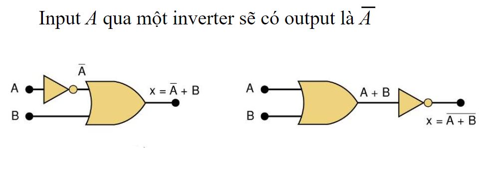


### Phân tích giá trị ngõ ra của một mạch số

Bước 1: Lập bảng sự thật và liệt kê tất cả các inputs có trong mạch logic tổ hợp

Bước 2: Tạo ra một cột trong bảng sự thật cho mỗi tín hiệu trung gian (node)

Bước 3: Điền vào các giá trị tín hiệu của cột node v

Bước 4: Dự đoán trước giá trị tín hiệu của node w là outputs của cổng logic BC

Bước 5: Kết hợp một cách logic 2 cột v và w để dự đoán cho output x

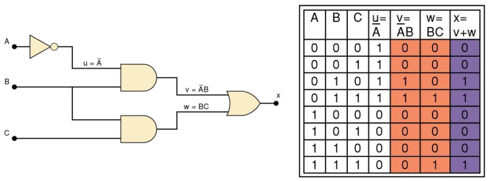

### Đại số Boolean

Máy tính kỹ thuật số là tổng hợp các mạch logic được thực hiện dựa trên những biểu thức của đại số Boolean (biểu thức Boolean)

Biểu thức Boolean càng đơn giản, thì mạch thực hiện càng nhỏ 🡪 giá thành rẻ hơn, tiêu tốn ít công suất hơn, và thực hiện nhanh hơn mạch phức tạp

Dựa vào các định luật Boolean sẽ giúp ta đơn giản được các biểu thức Boolean về dạng đơn giản nhất

#### Định luật Boolean I

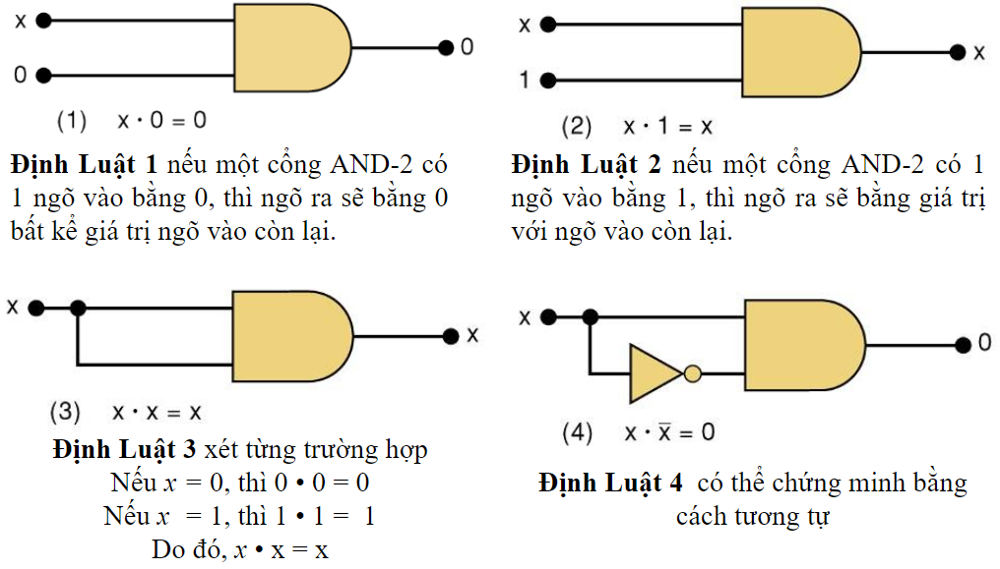

#### Định luật Boolean II

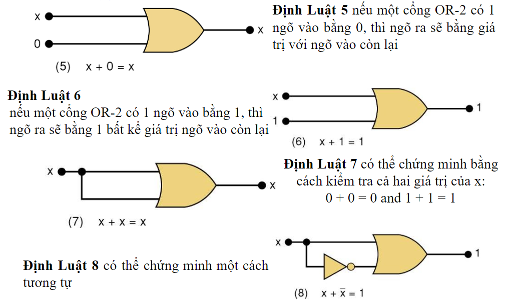

#### Định luật Boolean III

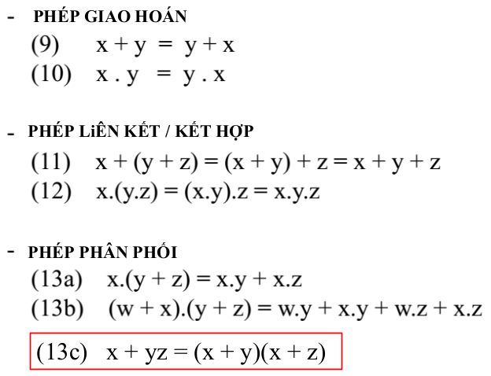

#### Định luật Boolean IV

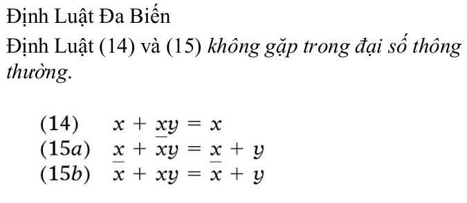

#### Định luật Boolean V

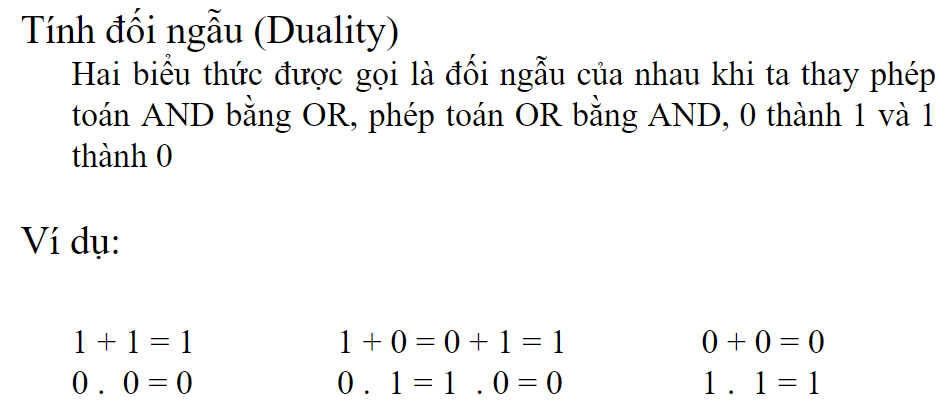

#### Định luật DeMorgan’s

.png)

.png)

Áp dụng định luật DeMorgan’s để biến đổi qua lại giữa:
`AND ⬄ NOR` và `OR ⬄ NAND`

Thực hiện như sau. Nghịch đảo tất cả input và output trong cổng logic cơ bản:

- Thêm ký hiệu dấu bù (bong bóng) tại ngõ vào/ngõ ra không có

- Xóa ký hiệu dấu bù (bong bóng) tại ngõ vào/ngõ ra có sẵn

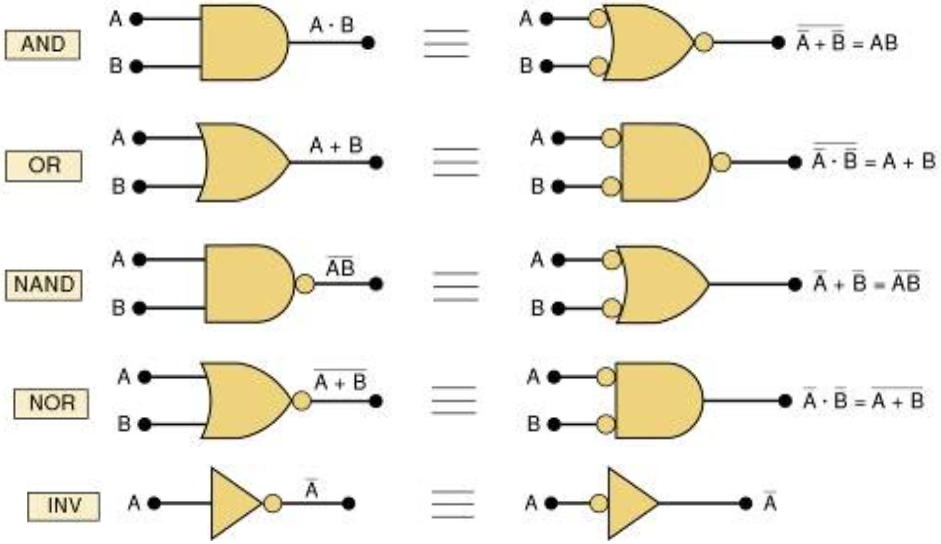

## Chương 4: Bìa Karnaugh

### Tổng quan Bìa Karnaugh

Chương này sẽ học về:

- Phương pháp đánh giá ngõ ra của một mạch logic cho trước.

- Phương pháp thiết kế một mạch logic từ biểu thức đại số cho trước.

- Phương pháp thiết kế một mạch logic từ yêu cầu cho trước.

- Các phương pháp để đơn giản/tối ưu một mạch logic 🡪 giúp cho mạch thiết kế được tối ưu về diện tích, chi phí và tốc độ.

### Các dạng biểu diễn biểu thức logic

#### Khái niệm tích chuẩn, tổng chuẩn

**Tích chuẩn (minterm)**: **m~i~** là các *số hạng tích* (AND) mà tất cả các biến xuất hiện ở dạng bình thường (nếu là 1) hoặc dạng bù (complement) (nếu là 0)

**Tổng chuẩn (Maxterm)**: **M~i~** là các *số hạng tổng* (OR) mà tất cả các biến xuất hiện ở dạng bình thường (nếu là 0) hoặc dạng bù (complement) (nếu là 1)

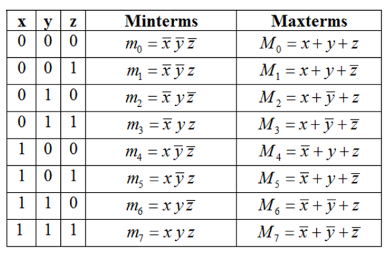

#### Dạng chính tắc (Canonical form)

**Dạng chính tắc 1**: là dạng *tổng của các tích chuẩn_1* (_**Minterms_1**_) (*tích chuẩn_1* là tích chuẩn mà tại tổ hợp đó hàm Boolean có giá trị 1).

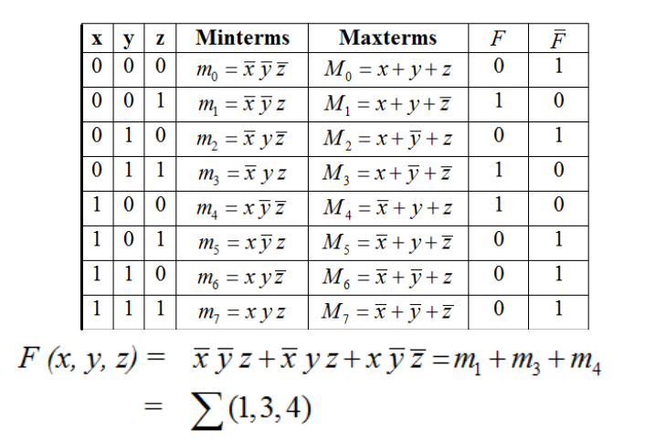

**Dạng chính tắc 2**: là dạng *tích của các tổng chuẩn_0* (_**Maxterms_0**_) (*tổng chuẩn_0* là tổng chuẩn mà tại tổ hợp đó hàm Boolean có giá trị 0).


#### Dạng chuẩn (Standard form)

Dạng chính tắc có thể được đơn giản hoá để thành dạng chuẩn tương đương. Ở dạng đơn giản hoá này, có thể có ít nhóm `AND/OR` và các nhóm này có ít biến hơn

**Dạng tổng các tích - SoP (Sum-of-Product)**
Ví dụ: `F(x,y,z)=xy+xz+yz`

**Dạng tích các tổng - PoS (Product-of-Sum)**
Ví dụ : `F(x,y,z)=(x+y)(x+z)(y+z)`

### Thiết kế mạch số

```Example
Ví dụ:
- Thiết kế một mạch logic số với 3 ngõ vào, 1 ngõ ra
- Output bằng 1 khi có từ 2 ngõ vào trở lên có giá trị bằng 1
```

#### Các bước thiết kế một mạch logic số

Bước 1: Xây dựng bảng sự thật/chân trị


Bước 2: Chuyển bảng sự thật sang biểu thức logic


Bước 3: Đơn giản biểu thức logic qua biến đổi đại số nhằm làm giảm số cổng logic cần sử dụng (nhằm làm giảm chi phí thiết kế)


Bước 4: Vẽ sơ đồ mạch logic cho


#### Chi phí thiết kế một mạch logic số

Chi phí (cost) để tạo ra một mạch logic số liên quan đến:

- Số cổng (gates) được sử dụng

- Số đầu vào của mỗi cổng

Chi phí của một biểu thức Boolean B được biểu diễn dưới dạng tổng của các tích (Sum-of-Product) như sau:

.png)

Trong đó K là số các term (thành phần tích) trong biểu thức B

- O(B) : số các term trong biểu thức B

- P~J~(B): số các literal (biến) trong term thứ j của biểu thức B

.png)

**Ví dụ**:


#### Hạn chế của việc rút gọn bằng biến đổi đại số

Không có hệ thống

Rất khó để kiểm tra rằng giải pháp tìm ra đã là tối ưu hay chưa

### Bìa Karnaugh (bản đồ Karnaugh)

Bìa Karnaugh là biểu diễn của bảng sự thật dưới dạng một ma trận các ô *(matrix of squares/cells)* trong đó mỗi ô tương ứng với dạng *tích chuẩn (Minterm)* hay *dạng tổng chuẩn (Maxterm)*.

Với một hàm có **n biến (literal)**, chúng ta cần một **bảng sự thật có 2^n^ hàng**, tương ứng **bìa Karnaugh có 2^n^ ô (cell)**.

Để biểu diễn một hàm logic, *một giá trị ngõ ra* trong bảng sự thật sẽ là *một giá trị tương ứng trong một ô (cell)* trong bìa Karnaugh

#### Phương pháp rút gọn bìa Karnaugh

Bước 1: Vẽ bìa Karnaugh gồm 2^n^ ô có hàm logic có n biến ngõ vào

Bước 2: Đặt giá trị ngõ vào và ngõ ra lên bìa Karnaugh

- Giá trị ngõ vào giữa 2 ô liên tiếp chỉ được **khác nhau một bit**.  
- Giá trị ngõ ra đặt trong ô tương ứng với giá trị ngõ vào. Cần lưu ý trọng số của mỗi biến ngõ vào để đảm bảo giá trị ngõ ra được đặt đúng.

Bước 3: Gom nhóm

- Gom nhóm các ô liên kề nhau có giá trị ngõ ra giống nhau. **Các ô được xem là liền kề nhau khi ngõ vào của nó chỉ khác nhau 1 bit**. Có 2 phương pháp:

  - Gom nhóm theo Minterm: gom nhóm các ô có giá trị “1”
  - Gom nhóm theo Maxterm: gom nhóm các ô có giá trị “0”

- Mỗi nhóm có thể có 2^i^ ô
- Nhóm có khả năng gom nhóm lớn hơn cần được ưu tiên thực hiện trước. Một ô có thể được gom bởi nhiều nhóm khác nhau.
- Gom nhóm kết thúc khi tất cả các giá trị “1” trong bìa Karnaugh đã được gom (theo Minterm), hoặc các giá trị “0” trong bìa đã được gom (theo Maxterm)

Bước 4: Rút gọn biểu thức

- Nhóm có 2^n^ ô liền kề nhau sẽ rút gọn được n biến.
- Mỗi một nhóm sẽ được biểu diễn thành một term của biểu thức rút gọn (theo Minterm hoặc Maxterm)
- Trong một nhóm, nếu biến ngõ vào nào thay đổi thì được bỏ đi khỏi term đó, nếu biến ngõ vào nào giữ nguyên thì sẽ được giữ lại trong term đó, theo quy tắc:

  - Nếu trong bước 3 gom nhóm theo Minterm: biến ngõ vào giữ nguyên nếu nó mang giá trị “1”, biến ngõ vào mang dấu bù nếu nó mang giá trị “0”.
  - Nếu trong bước 3 gom nhóm theo Maxterm: biến ngõ vào giữ nguyên nếu nó mang giá trị “0”, biến ngõ vào mang dấu bù nếu nó mang giá trị “1”.

#### Bìa Karnaugh 2 biến


#### Bìa Karnaugh 3 biến


**Lưu ý**: có thể sử dụng cách nào để biểu diễn bìa-K cũng được, nhưng phải lưu ý _**trọng số của các biến**_ thì mới đảm bảo thứ tự các ô theo giá trị thập phân.


```Example
Example 1: A'BC+ABC+A'BC'+ABC'=A'BC+A'BC'+ABC+ABC'=A'B+AB=B
Example 2: A'BC'+ABC'=BC'
Example 3: AB'C'+ABC'=AC'
```


#### Bìa Karnaugh 4 biến


#### Bìa Karnaugh 5 biến

##### Solution 1 With Method Karnaugh 5 Variable


##### Solution 2 With Method Karnaugh 5 Variable


#### Đơn giản biểu thức theo Maxterm (Product of Sum)


#### Biểu thức mang giá trị tùy định - Hàm đặc tả không đầy đủ (Incompletely Specified Functions)


- Giả thuyết: N1 không bao giờ cho kết quả ABC = 001 và ABC = 110
- Câu hỏi : F cho ra giá trị gì trong trường hợp ABC = 001 và ABC = 110 ?

Giả sử F(0,0,1) = 0 và F(1,1,0)=0, ta có biểu thức sau:


```Example
F(A,B,C) = A’B’C’ + A’BC’ + A’BC + ABC 
= A’C’(B’ + B) + (A’ + A)BC 
= A’C’·1 + 1·BC 
= A’C’ + BC 
```

Tuy nhiên, nếu giả sử F(0,0,1)=1 và F(1,1,0)=1, ta có biểu thức sau:


```Example
F(A,B,C) = A’B’C’ + A’B’C + A’BC’ + A’BC + ABC’ + ABC 
= A’B’(C’ + C) + A’B(C’ + C) + AB(C’ + C) 
= A’B’ ·1 + A’B ·1 + AB ·1
= A’B’ + A’B + AB
= A’B’ + A’B + A’B + AB (A'B = A'(B+B) = A'B + A'B)
= A’(B’ + B) + (A’ + A)B
= A’·1 + 1·B
= A’ + B
```

Tất cả các ô 1 phải được khoanh tròn, nhưng với ô có giá trị X thì tùy chọn, các ô này chỉ được

- Xem xét là **1** nếu đơn giản biểu thức theo dạng **SOP**
- Xem xét là **0** nếu đơn giản biểu thức theo dạng **POS**


